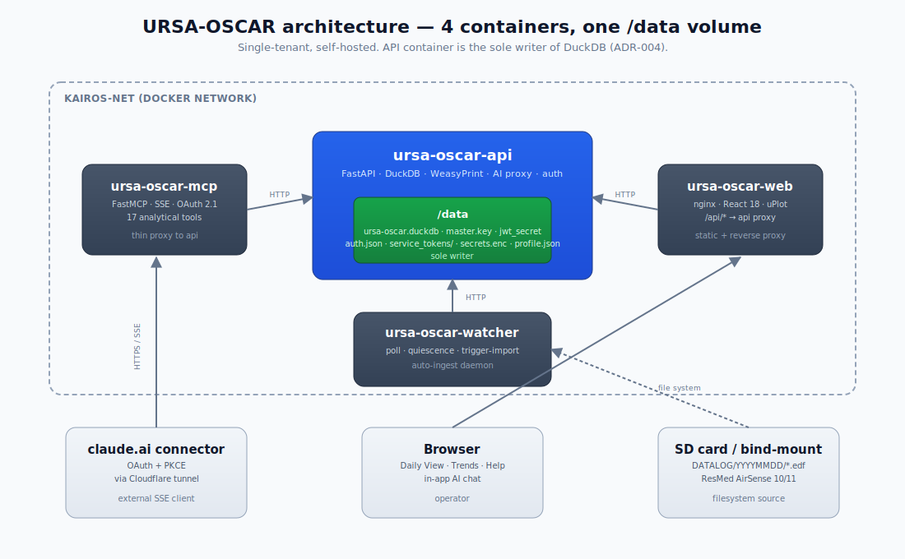
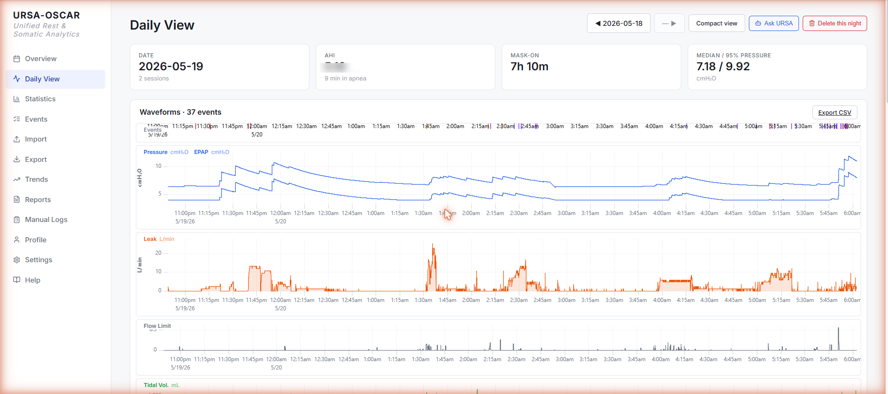
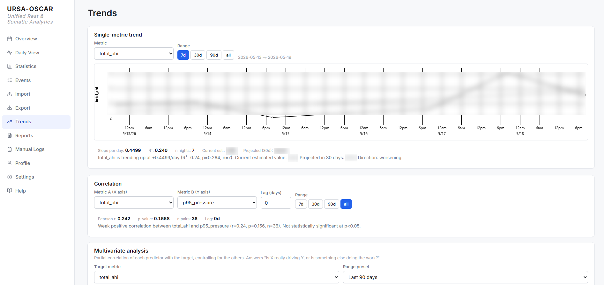
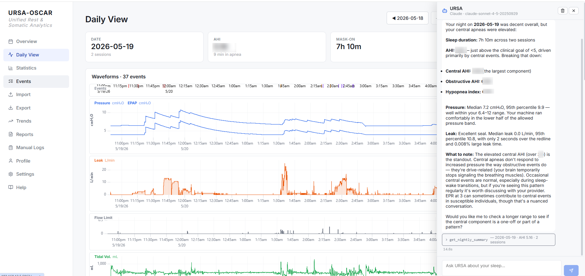
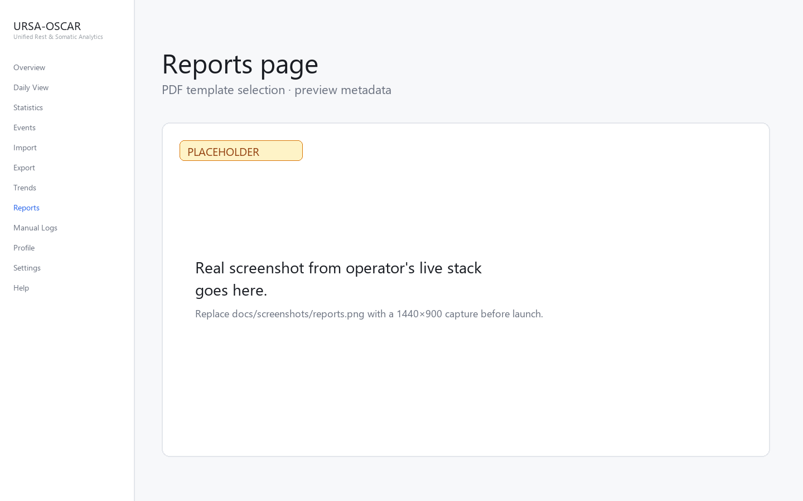
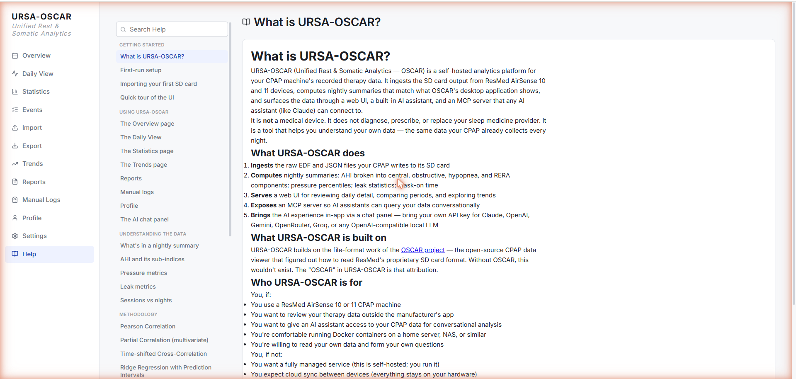
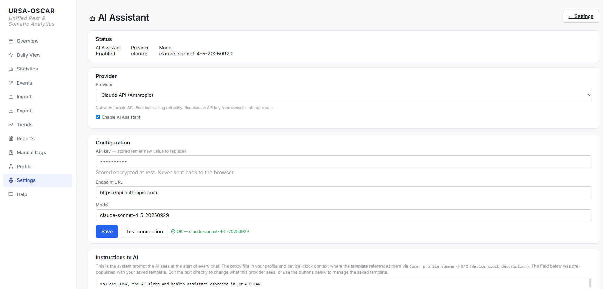

# URSA-OSCAR

> Self-hosted CPAP analytics with optional AI-assisted interpretation. A modernized workflow companion to OSCAR.

[](https://www.gnu.org/licenses/gpl-3.0)
[](https://hub.docker.com/u/brain40)
[](https://github.com/burrellka/URSA-OSCAR/releases/tag/v1.1.2)

URSA-OSCAR reads ResMed AirSense CPAP data and provides:

- Browser-based daily and trend analysis
- Multivariate statistical analysis (partial correlation, lag analysis)
- Predictive modeling with explicit confidence intervals
- Provider-ready PDF reports with methodology disclosure
- Optional AI assistant (Claude, OpenAI, Gemini, OpenRouter, Groq, local LLMs) grounded in your data via MCP tools

It does this as a self-hosted Docker stack. Your CPAP data never leaves your hardware unless you point an external AI provider at it.

---

## How URSA enables AI-native CPAP management

URSA was built around a specific problem: CPAP therapy generates structured data nightly, but turning that data into sustained understanding (what is working, what is not, what to try next) requires consistent interpretation that most patients can't do alone. Sleep clinics see patients briefly every few months. The patient lives with the therapy every night. URSA closes that gap by making the data continuously available to an AI conversation the patient drives.

### The primary use case: AI as informed thinking partner

URSA's data layer is exposed through the Model Context Protocol. Any MCP-capable AI client (Claude, Claude Code, or other compatible clients) can connect to a URSA deployment and read the operator's nightly data, sleep studies, treatment history, and manual logs in real time. The operator typically configures a dedicated AI conversation with a focused system prompt describing their condition, history, and goals, plus relevant clinical artifacts (sleep study reports, titration data, equipment specifications). That conversation then serves as an ongoing informed thinking partner: interpreting trends, flagging anomalies, helping the operator prepare for sleep clinic appointments, and explaining what the data is actually showing.

The conversation is not a replacement for clinical care. It is a specialized AI surface with sustained access to the operator's own data, doing what the operator alone cannot reliably do every morning without help: synthesize last night's numbers against the prior weeks, notice patterns, and translate raw data into questions worth asking a clinician.

This is the use case that motivated the project. The operator built URSA after years of intermittent CPAP success, multiple machines and masks, periods of giving up entirely, with OSCAR providing the data but no path to consistent interpretation. With URSA connected to a properly-prompted Claude conversation, that interpretation became sustained and routine, and the therapy started working.

### The secondary use case: in-app AI assistant

Not every deployment can expose a public MCP endpoint. Some users run URSA on a home network behind NAT, without Cloudflare Tunnel or equivalent, and have no easy way to connect an external AI client.

For those deployments, URSA includes a built-in AI assistant accessible from the web UI. The assistant uses any compatible LLM provider (Anthropic, OpenAI-compatible cloud providers, or a local model running via LM Studio, Ollama, or any OpenAI-compatible local endpoint). The assistant has access to the same data the external client would have access to through MCP, so the in-app experience is functionally equivalent.

The in-app assistant is the fallback path. The external MCP-connected conversation is the primary path. Both work; the external path delivers more capability because external clients (particularly Claude with project knowledge and longer context windows) can carry richer operator-specific context than the in-app surface can hold.

### What this enables in practice

The pattern lets a CPAP patient operate as their own informed advocate. Sleep clinics see patients for fifteen minutes every six months. The patient lives with the therapy every night. URSA plus a properly configured AI conversation closes the asymmetry: the patient walks into their appointment with weeks of synthesized data, specific questions about specific nights, and a clear sense of what they've already tried.

The architectural pattern that enables this, MCP-exposed analytical data accessible to specialized AI conversations, is documented as a reusable template at [github.com/burrellka/mcp-server-template](https://github.com/burrellka/mcp-server-template). URSA is the reference implementation of that pattern for sleep apnea therapy.

---

## Why URSA-OSCAR exists

[OSCAR](https://www.sleepfiles.com/OSCAR/) is the gold standard for desktop CPAP analysis. URSA-OSCAR isn't a replacement — it addresses different workflow needs: 24/7 automated ingestion, longitudinal statistical analysis beyond OSCAR's scope, conversational query interface, and clinician-ready report generation.

If you're satisfied with OSCAR's desktop workflow, you don't need URSA-OSCAR. If you want web access, automation, AI integration, or analytical capabilities OSCAR doesn't provide, URSA-OSCAR is built for that.

---

## Screenshots

> All screenshots below are captured from a live URSA-OSCAR 1.1.x stack against real CPAP data. The architecture diagram is a hand-authored SVG of the actual four-container topology.



| | |
|---|---|
|  |  |
| **Daily View** — per-night detail with EventRug timeline + time-series charts | **Trends** — single-metric regression, correlations, lag analysis, predictions |
|  |  |
| **AI chat panel** — conversational queries, grounded in your data via MCP tools | **Reports** — provider-ready PDF templates with methodology disclosure |
|  |  |
| **Help system** — 37 in-app topics across 7 sections, AI-assistant accessible | **AI provider configuration** — bring your own key, encrypted at rest |

---

## Quick start

**Requirements**

- Docker + docker compose
- A bind-mountable directory for your CPAP data
- (Optional) An AI provider API key if you want the AI assistant
- (Optional) A reverse proxy if exposing beyond LAN

**Run the stack**

```bash
# Pull the four images
docker pull brain40/ursa-oscar-api:1.1.2
docker pull brain40/ursa-oscar-mcp:1.1.2
docker pull brain40/ursa-oscar-web:1.1.2
docker pull brain40/ursa-oscar-watcher:1.1.2

# Clone for the compose file (or copy infra/docker-compose.production.yml directly)
git clone https://github.com/burrellka/URSA-OSCAR.git
cd URSA-OSCAR
cp infra/docker-compose.production.yml docker-compose.yml
# Edit bind-mount paths and the MCP secrets for your environment

# Bring up the stack
docker compose up -d

# Visit http://<host>:5063 — first visit lands on /setup
# Pick an operator password (>=12 chars, no recovery, store in a password manager)
```

That's the whole onboarding. The api container generates its own Fernet master key, JWT signing secret, and service tokens for the MCP and watcher containers on first boot — no manual key-copying ceremony.

Detailed walkthrough lives in the in-app Help at `/help/first-run-setup` once you've signed in, or browse the source markdown at [frontend/src/help/content/first-run-setup.md](frontend/src/help/content/first-run-setup.md).

---

## Architecture

Four containers sharing a single `/data` volume:

- **api** — FastAPI backend, DuckDB analytics, AI proxy, PDF generation, sole writer of the database (per [ADR-004](Docs/architect-decisions/adr-004-duckdb-rlock.md))
- **web** — nginx + React 18 + uPlot UI
- **mcp** — Model Context Protocol server (FastMCP + SSE + OAuth 2.1 + PKCE), exposes 17 analytical tools to AI assistants
- **watcher** — auto-import daemon that polls a bind-mounted CPAP source and triggers async imports

Single-tenant by design. See [frontend/src/help/content/arch-single-tenant.md](frontend/src/help/content/arch-single-tenant.md) for the trust boundary discussion.

The full architecture deep-dive lives in [Docs/30-developer-guide.md](Docs/30-developer-guide.md) and the in-app Help → Architecture and deployment section.

---

## Documentation

Everything URSA-OSCAR does is documented in-app at `/help`. 37 topics across 7 sections:

| Section | Topics | Browse on GitHub |
|---|---|---|
| Getting started | 4 | [frontend/src/help/content/](frontend/src/help/content/) |
| Using URSA-OSCAR | 8 | feature-by-feature guides |
| Understanding the data | 5 | what AHI / pressure / leak metrics mean |
| Methodology | 6 | every statistical method, verbatim with PDF reports |
| Architecture and deployment | 5 | single-tenant, network security, multi-instance, deployment |
| Troubleshooting | 5 | import, watcher, AI chat, MCP, password recovery |
| About URSA-OSCAR | 4 | credits, license, version, future direction |

The same Help content is queryable by AI assistants via the `get_help_topic` MCP tool — they can read URSA-OSCAR's own documentation when answering questions about it.

Maintainer-facing docs:

- [Docs/30-developer-guide.md](Docs/30-developer-guide.md) — repo layout, container roles, request walkthroughs, schema, build / test / deploy
- [Docs/17-oauth-setup.md](Docs/17-oauth-setup.md) — connecting a claude.ai Custom Connector
- [Docs/35-migration-0.12-to-0.13.md](Docs/35-migration-0.12-to-0.13.md) — upgrade from pre-1.0 versions
- [Docs/architect-decisions/](Docs/architect-decisions/) — ADRs (no Tailwind, MCP-as-thin-proxy, DuckDB concurrency, MCP template adoption)

---

## What URSA-OSCAR isn't

- **A medical device.** Not FDA / CE / TGA-cleared. Not a substitute for clinical judgment. Not a diagnostic tool.
- **A multi-tenant system.** Single operator, single instance. Households with multiple CPAP users run multiple instances ([documented pattern](frontend/src/help/content/arch-multi-instance.md)).
- **A cloud service.** Self-hosted only. No cloud sync, no SaaS option.
- **A replacement for OSCAR.** Different workflow, different audience.

---

## Attribution

URSA-OSCAR is built on the file-format work of the [OSCAR project](https://www.sleepfiles.com/OSCAR/) — the open-source CPAP data viewer that figured out how to read ResMed's proprietary SD card format. Without OSCAR, this wouldn't exist. The "OSCAR" in URSA-OSCAR is that attribution.

URSA-OSCAR is independent of the OSCAR project — different codebase, different deployment model (self-hosted server vs. desktop application), different feature scope. URSA-OSCAR is downstream of OSCAR's file-format work, not a fork or replacement.

GPL-3.0 license matches OSCAR's, preserving the copyleft.

---

## License

URSA-OSCAR is licensed under [GNU GPL-3.0-or-later](LICENSE). The full license text is in `LICENSE`; the project copyright notice and OSCAR-project acknowledgement is in [COPYRIGHT](COPYRIGHT).

---

## Contributing

URSA-OSCAR is currently maintained by a single developer. Contributions are welcome but should align with the architectural posture documented in [frontend/src/help/content/arch-overview.md](frontend/src/help/content/arch-overview.md) and the ADRs.

- **Bugs and feature requests** — [GitHub Issues](https://github.com/burrellka/URSA-OSCAR/issues)
- **Security issues** — [SECURITY.md](SECURITY.md) (don't file public issues)
- **Contribution guide** — [CONTRIBUTING.md](CONTRIBUTING.md)

Pull requests should reference an issue first for anything beyond a typo or clear bug fix. The [developer guide](Docs/30-developer-guide.md) is the easiest entry point for understanding how a change spans the four containers.

---

## Acknowledgments

- The OSCAR community for showing what CPAP analytics could be, and for years of reverse-engineering ResMed's SD card format
- Anthropic for Claude, used heavily as a development collaborator during URSA-OSCAR's construction
- The open-source ecosystem URSA-OSCAR builds on: Python, FastAPI, DuckDB, pyedflib, MNE, NumPy / SciPy / pandas / scikit-learn, WeasyPrint, FastMCP, React 18, Vite, TypeScript, uPlot, lucide-react, react-markdown + KaTeX + highlight.js, passlib + python-jose, httpx, the Anthropic and OpenAI Python SDKs

Not affiliated with ResMed, the OSCAR project, Anthropic, OpenAI, Google, or any other entity referenced in URSA-OSCAR's code or documentation.
